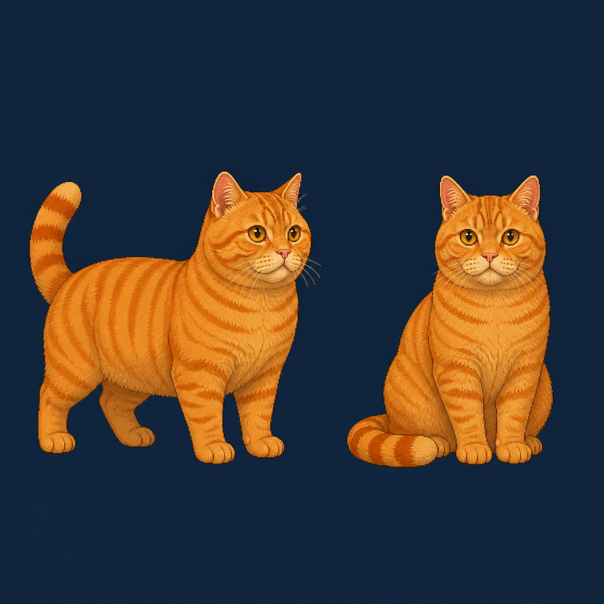

# Orange Tabby Production Brief v1

**Issue:** #23

**Status:** Big-ginger appearance direction approved; production art not yet received

**Runtime target:** Rounded short-haired, ten-action CatStar package
**Identity authority:** `artifacts/art/candidates/active/product-cat-model-sheet-v1/`

This brief defines the first release-quality orange-tabby **毛色预设**. It is
an art-production handoff, not permission to ship the current deterministic
orange derivative. The gray-white motion master supplies anatomy, pose,
timing, frame composition, alpha geometry, anchors, and contact conventions
only. Final orange-tabby pixels must come from one rights-cleared,
identity-consistent production process and receive their own review.

## Approved Appearance Lock

The approved direction is a warm orange tabby with:

- warm golden-orange fur covering at least 85% of the visible cat;
- a light cream muzzle and chin only;
- an orange chest, belly, legs, and paws with no white bib or socks;
- low-contrast deeper-orange tabby markings rather than brown or black bands;
- golden-amber irises that remain distinct from the orange coat;
- a muted brick-pink nose and coordinated muted brick-pink paw pads.

Neutral palette anchors below describe relationships, not a flat fill. The
artist may shift values for the model sheet's cool window light and warm lamp
light while preserving the ordering and identity.

| Role | Neutral anchor | Requirement |
| --- | --- | --- |
| Orange midtone | `#D98220` | Warm golden ginger; never muddy brown, neon, or mascot-yellow. |
| Orange light | `#F0AA3C` | Keeps facial planes and limbs readable near the lamp. |
| Tabby stripe | `#B96318` | Same-hue deeper orange with restrained contrast; never a dark brown mask. |
| Cream muzzle | `#EFCB91` | Limited to muzzle and chin; must not expand into a white bib. |
| Iris | `#D3A52C` | Golden amber, stable across all awake actions. |
| Nose | `#B96862` | Muted brick pink, not candy pink. |
| Paw pad | `#965451` | Deeper companion tone to the nose. |
| Soft outline | `#4B302B` | Restrained dark warm outline consistent with the motion master. |

## Approved Direction Prototype



`approved-direction-prototype.png` was approved by meetwk0916 on 2026-08-16
as the appearance direction for Issue #23. SHA-256:
`aba920526ece578f2ca8f19b16ace035c03f0b6b2cf5ab6eb6f500dae2ca511e`.
The built-in ImageGen prompt and reference roles are recorded in
[`generation-prompt.md`](generation-prompt.md).

This image approves orange coverage, stripe contrast, face color, and the
overall “大橘” read only. It is an AI-generated direction prototype, not the
editable production authority, not a `96x96` runtime sheet, and not evidence of
public distribution rights.

## Runnable Internal Preview

The current `orange-tabby` runtime preset uses independent internal preview
sheets derived from the approved big-ginger direction. It exists so the round
head, broad body, short legs, substantial paws, markings, and room-scale read
can be judged across all ten actions before production source art arrives. Its
`idle`, `sit`, and `walk` sheets use the shared cross-action scale authority and
bottom-center registration, but their silhouette intentionally differs from
the gray-white motion geometry.

This preview does not supersede the delivery layout or acceptance sequence
below. It has no rights-cleared editable production source, and its independent
silhouette conflicts with the current same-geometry coat-preset release
contract. It must remain internal-only and cannot close Issue #23 or be
recorded as release-approved runtime evidence.

The follow-up appearance experiment lives in
`artifacts/art/candidates/active/product-cat-orange-tabby-preview-v2/`. Its ten
newly drawn action sheets test the approved prototype's round head, broad body,
short legs, substantial paws, and marking continuity at runtime scale. These
internal-only sheets demonstrate a complete visual repertoire but still lack a
rights-cleared editable production source, so they do not alter the production
acceptance boundary below.

## Marking Lock

Markings must describe one cat rather than being redrawn opportunistically per
pose.

- The forehead carries one subtle same-hue tabby `M`, with the center aligned to the
  nose bridge and two inner strokes remaining narrower than the outer crown
  strokes.
- Each visible cheek carries two short tapered stripes. They may compress in
  perspective but must not cross the eye or merge into a face mask.
- Two broken collar bands wrap the upper neck. Their visible length changes
  with head rotation; their order does not reverse.
- Shoulder and flank stripes taper toward the belly. Preserve their relative
  order across standing, sitting, resting, and stretched poses instead of
  copying screen-space bands from another frame.
- The tail carries six readable deeper-orange rings plus a deeper-orange tip. Foreshortening may
  occlude rings, but may not create or reorder them.
- Light cream is limited to the muzzle and chin. Chest, belly, legs, and paws
  stay orange in every action; white bibs, white socks, and white paws fail the
  appearance lock.
- Do not add freckles, accessories, glow, halo, cast shadow, loose particles,
  or baked room props.

## Locked Motion And Raster Contract

Do not redraw anatomy or alter timing while applying the coat. Preserve the
gray-white master's exact canvas geometry, right-facing default orientation,
bottom-center alignment, alpha silhouette, frame composition, and contact
line. The machine-readable contract is in
[`production-contract.json`](production-contract.json).

Every delivered sheet must:

- use `96x96` transparent cells in one horizontal PNG strip;
- retain the exact action frame count and order;
- match the gray-white master alpha geometry pixel-for-pixel unless a reviewed
  pixel-level exception is recorded before import;
- keep the face, body mass, ears, tail, paws, outline thickness, pixel density,
  and lighting direction stable;
- contain no detached pixel islands, baked shadow, background, guide, label,
  or source-layer residue.

## Action Review Notes

| Action | Orange-tabby-specific review |
| --- | --- |
| `idle` | Subtle M mark, cheek stripes, fully orange paws, and tail-ring count remain stable through breathing and blinking. |
| `sit` | Orange chest remains continuous; flank stripes wrap the seated mass rather than becoming straight vertical bars. |
| `walk` | All four legs and paws remain orange through the gait; stripes do not slide across the torso. |
| `jump` | Orange belly and tail rings remain coherent through foreshortening; paws retain separation near the bench without white tips. |
| `eat` | Lowered head keeps the M mark and cheek-stripe order; muzzle remains readable beside the bowl. |
| `lie` | Folded orange legs remain individually readable; awake golden-amber iris color remains visible. |
| `sleep` | Closed eyes remain distinct from face stripes; curled tail rings retain their order. |
| `groom` | Raised paw remains orange and preserves its paw-pad color; face markings do not migrate during contact. |
| `stretch` | Lengthened torso keeps stripe spacing anatomical; orange forelegs retain separate silhouettes. |
| `interact` | Slow blink and head turn preserve the same M mark, cheek stripes, iris, and nose. |

## Room-Lighting Gate

The appearance must pass in the real Phaser room, not only on a transparent
sheet.

- Under cool window light, orange midtones must not turn muddy brown and the
  face must remain separate from the dark window and bench.
- Under warm lamp light, coat highlights must not merge with the floor, lamp,
  bowl, or blanket; the cream muzzle and fully orange chest and paws must retain
  separate volume.
- At `390x844`, the M mark, eye line, paw separation, and action silhouette must
  remain readable without enlarging the cat.
- Desktop and mobile review must cover entry, full motion, and exit for all ten
  actions. Static boards support this review but do not replace motion.

## Delivery Layout

Deliver the production source package as:

```text
artifacts/art/candidates/active/product-cat-orange-tabby-v1/
  README.md
  rights/
  sources/
  sprite-sheets-96/
    idle.png
    sit.png
    walk.png
    jump.png
    eat.png
    lie.png
    sleep.png
    groom.png
    stretch.png
    interact.png
```

`sources/` must contain the editable layered authority used for all ten
actions. `rights/` must contain the completed evidence listed in
[`intake-checklist.md`](intake-checklist.md). Do not overwrite runtime assets
until the source package, rights record, and structural checks are reviewable.

## Acceptance Sequence

1. Review enlarged source art and representative `96x96` cells for the locked
   appearance and marking map.
2. Complete every field in `intake-checklist.md`; unresolved fields keep the
   package internal-only and block Issue #23.
3. Copy the ten approved sheets into
   `public/assets/scenes/window-room/cat/orange-tabby/`.
4. Run `npm run check:assets` and verify exact alpha geometry against the
   gray-white master for all ten actions.
5. Verify passport selection, local persistence, and runtime loading through
   the existing end-to-end seam.
6. Capture the exact preset matrix:

   ```bash
   npm run review:motion -- \
     --preset orange-tabby \
     --output artifacts/art/runtime-motion-review/YYYY-MM-DD-orange-tabby-vN
   ```

7. Record a human pass or defect for every desktop/mobile action entry. Review
   marking continuity, eye/nose/paw-pad harmony, room contrast, and identity.
8. Run the full repository gates from `AGENTS.md`. Any source, asset, test,
   build, or configuration change invalidates stale fingerprint-bound evidence.
9. Update `docs/art/runtime-map.md`, `docs/art/rights-and-provenance.md`, and
   `docs/status/current.md` only after the accepted package is the actual
   runtime source.

## Current Comparison Evidence

The current internal appearance preview may be captured with the command above
to compare room scale and lighting. A narrowly scoped attribute such as
cross-action scale may receive an explicit human pass, but that decision must
name its limited scope. It is comparison evidence only and must not be
relabeled as production approval or committed as the accepted Issue #23
full-action evidence set.
